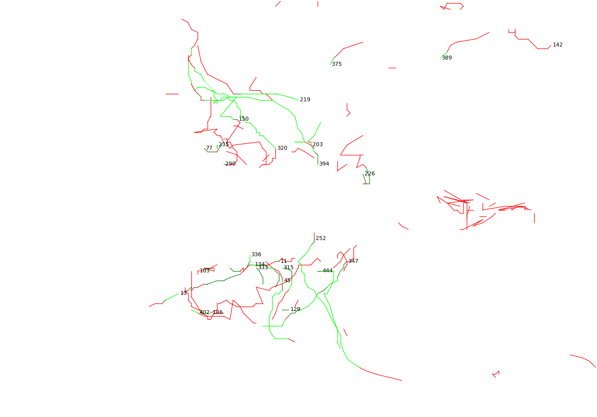
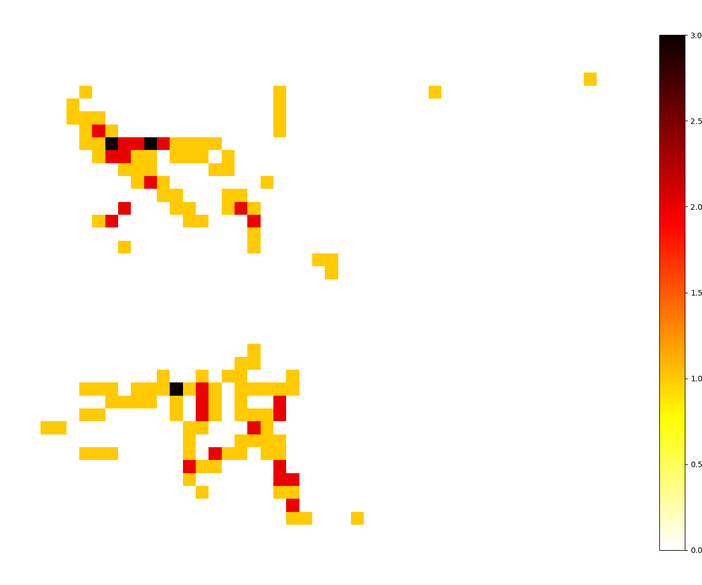

# ps-capstone

scripts for PlaSim capstone project

### primary scripts

`<ps_pres.py>` - generates MSLP, 1000-500 hPa thickness, 1000 hPa wind plots for each 6-hour output
`<ps_temp.py>` - generates temperature (currently `<tas>`) plots for each 6-hour output
`<reland.py>` - generates orography and land-sea mask PlaSim .sra format files from 0.25 degree topography data using area-conservative regridding
`<tcfind.py>` - writes a cyclone track file `<lowpts>` with location, wind, pressure, and nature (tropical, non-tropical) information, also generates diagnostic plots
`<tcplot.py>` - reads in cyclone track data from `<lowpts>` and plots them for visual assessment
`<tcheatmap.py>` - reads in cyclone track data from `<lowpts>` and bins the data on a lat/lon grid to create a "heatmap" of the spatial frequency of tropical cyclones and cyclogenesis

### peripheral scripts and tests

`<reland_ideal.py>` - area-conservative regridding example using xesmf
`<reland_interp2d.py>` - outdated bilinear spline interpolation version of `<reland.py>`, produces inadequate results when upsampling
`<reland_pavala.py>` - alternate version of `<reland.py>` which reads in .png format images with elevation data instead of the 0.25 degree topography data

## examples

tcplot.py example

{:width="720px"}

tcheatmap.py 2x2 degree bin activity example

{:width="720px"}
